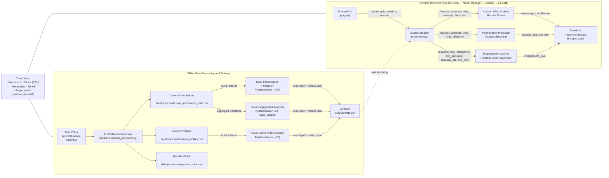

## System Architecture

```mermaid
flowchart LR
  %% Clean, left-to-right architecture with two distinct lanes to avoid crossings

  %% LANE 1: Runtime Inference (Top)
  subgraph RUNTIME["Runtime Inference (Streamlit App → Model Manager → Models → Results)"]
    direction LR
    UI["Streamlit UI\n(app.py)"] -->|inputs: quiz answers, session| MM["Model Manager\n(src/model.py)"]
    MM -->|features: accuracy, time, attempts, hints, etc.| LRN["Learner Classification\nRandomForest"]
    MM -->|features: attempts, time, hints, efficiency| PERF["Performance Prediction\nGradient Boosting"]
    MM -->|features: total_interactions, avg_accuracy, accuracy_std, avg_time| ENG["Engagement Analysis\nRandomForest (balanced)"]
    LRN -->|learner_type, confidence| RES["Results & Recommendations\n(Insights view)"]
    PERF -->|success_prob per item| RES
    ENG -->|engagement_level| RES
  end

  %% LANE 2: Offline Data → Training → Artifacts (Bottom)
  subgraph OFFLINE["Offline Data Processing and Training"]
    direction LR
    RAW["Raw CSVs\n(ASSISTments)\n data/raw/"] --> PROC["ASSISTmentsProcessor\n(data/assistments_processor.py)"]
    PROC --> CLEAN["Cleaned Interactions\n data/processed/clean_assistments_data.csv"]
    PROC --> PROFILES["Learner Profiles\n data/processed/learner_profiles.csv"]
    PROC --> QBANK["Question Bank\n data/processed/question_bank.csv"]

    CLEAN -->|build features| T_PERF["Train: Performance Prediction\nPipeline(Scaler→GB)"]
    PROFILES -->|build features| T_LRN["Train: Learner Classification\nPipeline(Scaler→RF)"]
    CLEAN -->|aggregate & balance| T_ENG["Train: Engagement Analysis\nPipeline(Scaler→RF, class_weight)"]

    T_PERF -->|model.pkl + metrics.json| ARTPKL["Artifacts\n models/artifacts/"]
    T_LRN  -->|model.pkl + metrics.json| ARTPKL
    T_ENG  -->|model.pkl + metrics.json| ARTPKL
  end

  %% CONNECTION: Artifacts consumed at runtime (no crossings)
  ARTPKL -. load at startup .-> MM

  %% Notes / Constraints
  NOTE["Constraints:\n- Inference < 100 ms (CPU)\n- Model size < 50 MB\n- Reproducible (random_state=42)"]
  NOTE --- RUNTIME
  NOTE --- OFFLINE
```

